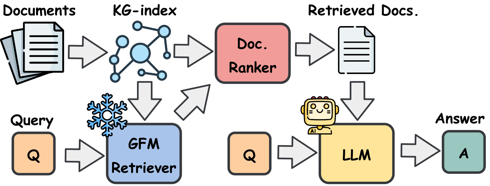

# GFM-RAG Documentation

Welcome to the documentation for GFM-RAG project.

## Overview

The GFM-RAG is the first graph foundation model-powered RAG pipeline that combines the power of graph neural networks to reason over knowledge graphs and retrieve relevant documents for question answering.

We first build a knowledge graph index (KG-index) from the documents to capture the relationships between knowledge. Then, we feed the query and constructed KG-index into the pre-trained graph foundation model (GFM) retriever to obtain relevant documents for LLM generation. The GFM retriever experiences large-scale training and can be directly applied to unseen datasets without fine-tuning.

For more details, please refer to our [project](https://github.com/RManLuo/gfm-rag) and [paper](https://www.arxiv.org/abs/2502.01113).

[\[中文解读\]](https://rman.top/2025/03/01/gfm-rag/)

## 🎉 News
- **[2025-10-01]** Checkout our latest progress: [G-reasoner: Foundation Models for Unified Reasoning over Graph-structured Knowledge](https://arxiv.org/abs/2509.24276). Code and model will be updated soon.
- **[2025-09-19]** We excited to share that [GFM-RAG](https://www.arxiv.org/abs/2502.01113) has been accepted by [NeurIPS 2025](https://neurips.cc/Conferences/2025).
- **[2025-06-03]** We have released a new version of [GFM-RAG (2025-06-03)](https://huggingface.co/rmanluo/GFM-RAG-8M/commit/62cf6398c5875af1c4e04bbb35e4c3b21904d4ac) which is pre-trained on 286 KGs. Performance comparison with the previous version can be found in [CHANGELOG](CHANGELOG.md).
- **[2025-02-06]** We have released the GFM-RAG codebase and a [8M pre-trained model](https://huggingface.co/rmanluo/GFM-RAG-8M). 🚀

## Features

- **Graph Foundation Model (GFM)**: A graph neural network-based retriever that can reason over the KG-index.
- **Knowledge Graph Index**: A knowledge graph index that captures the relationships between knowledge.
- **Efficiency**: The GFM-RAG pipeline is efficient in conducting multi-hop reasoning with single-step retrieval.
- **Generalizability**: The GFM-RAG can be directly applied to unseen datasets without fine-tuning.
- **Transferability**: The GFM-RAG can be fine-tuned on your own dataset to improve performance on specific domains.
- **Compatibility**: The GFM-RAG is compatible with arbitrary agent-based framework to conduct multi-step reasoning.
- **Interpretability**: The GFM-RAG can illustrate the captured reasoning paths for better understanding.
